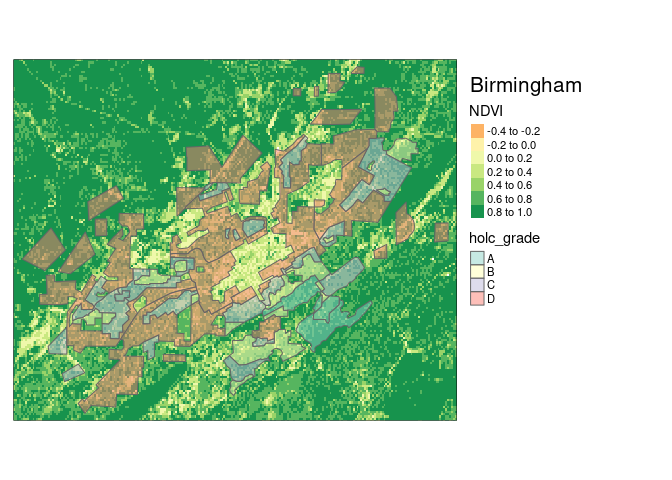
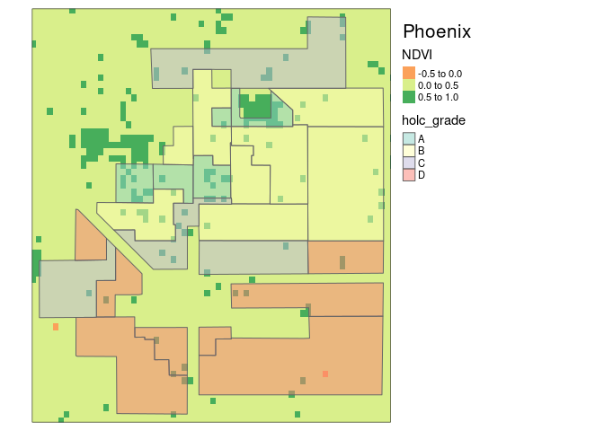
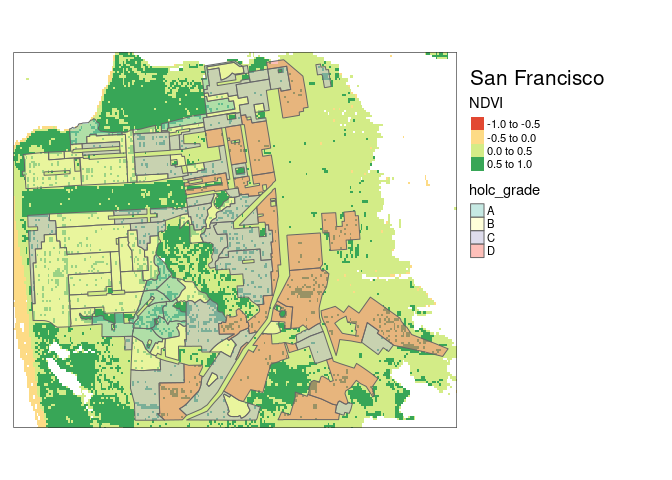
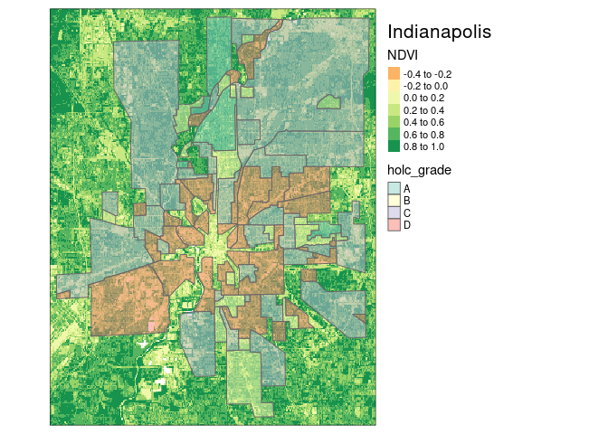
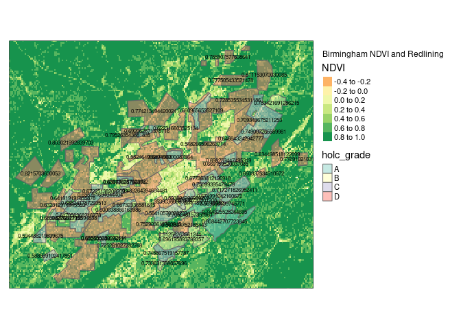
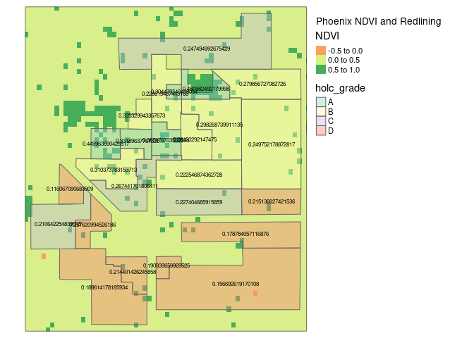
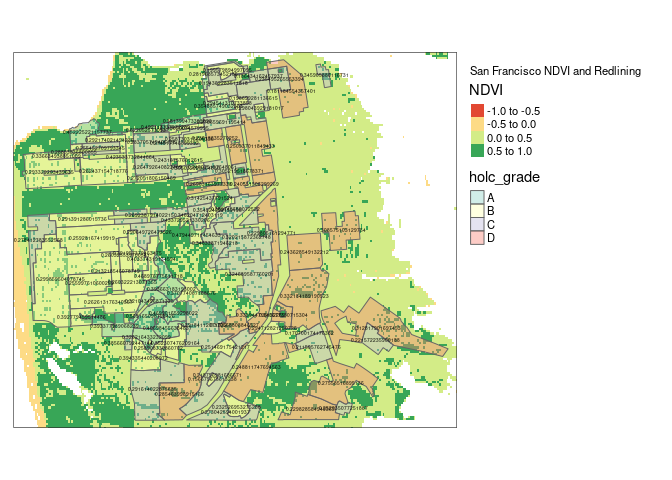
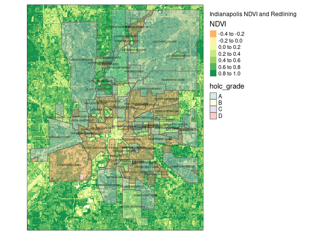
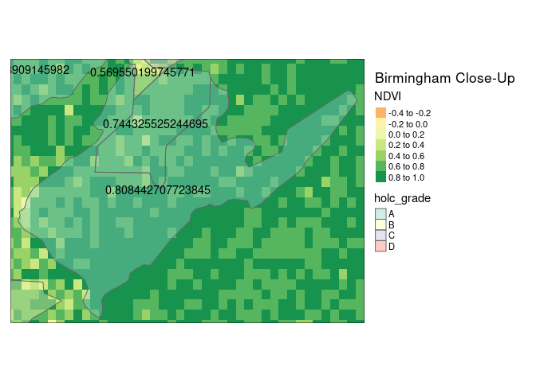
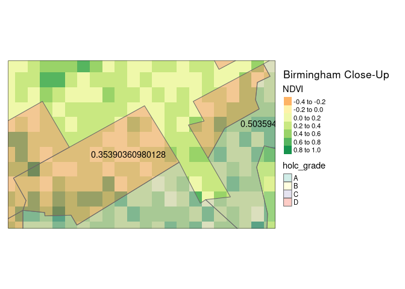

The ecological and evolutionary consequences of systemic racism
================
Riya Shrestha and Kristin Liu

## Learning objectives

This module provides an introduction to the fundamentals of working with
spatial vector and raster data in R while empirically exploring why
systematic and structural racism is interwined with urban ecological
processes. This module uses the Simple Features Access standard (ISO
19125) and tidyverse-style workflow using the sf package and emerging
ecosystem of r-spatial tools.

# Exercise

In August 2020, [Christopher
Schell](http://directory.tacoma.uw.edu/employee/cjschell) and collegues
published a review in *Science* on [‘The ecological and evolutionary
consequences of systemic racism in urban
environments’](https://science.sciencemag.org/content/early/2020/08/12/science.aay4497)
(DOI: 10.1126/science.aay4497), showing how systematic racism and
classism has significant impacts on ecological and evolutionary
processes within urban environments. Here we explore a subset of the
data used to support these findings in this review and the broader
literature.

The [press
release](https://www.washington.edu/news/2020/08/13/systemic-racism-has-consequences-for-all-life-in-cities/)
on the paper is worth a read:

> “Racism is destroying our planet, and how we treat each other is
> essentially structural violence against our natural world,” said lead
> author Christopher Schell, an assistant professor of urban ecology at
> the University of Washington Tacoma. “Rather than just changing the
> conversation about how we treat each other, this paper will hopefully
> change the conversation about how we treat the natural world.”

In the paper, Schell writes:

> “In multiple cases, neighborhood racial composition can be a stronger
> predictor of urban socio-ecological patterns than wealth.”

We are going to explore one metric for how structural racism and
classism underpin landscape heterogeneity in cities.

**Figure 2** in the Schell paper shows how NDVI (Normalized Difference
Vegetation Index) tracks historical redlining. 

We are going to recreate these city maps, and plot the distributions and
mean vegetation patterns across cities to explore the structural
inequality and racism that Schell et al highlight in their paper.

To do this we are going to use the following spatial data:

**1.Mapping Inequality:** (vector data)  
[here](https://dsl.richmond.edu/panorama/redlining/#loc=3/41.245/-105.469&text=intro)

> “As you explore the materials Mapping Inequality, you will quickly
> encounter exactly that kind of language, descriptions of
> the”infiltration" of what were quite often described as
> “subversive,” “undesirable,” “inharmonious,” or “lower grade”
> populations, for they are everywhere in the HOLC archive ….These
> grades were a tool for redlining: making it difficult or impossible
> for people in certain areas to access mortgage financing and thus
> become homeowners. Redlining directed both public and private capital
> to native-born white families and away from African American and
> immigrant families. As homeownership was arguably the most significant
> means of intergenerational wealth building in the United States in the
> twentieth century, these redlining practices from eight decades ago
> had long-term effects in creating wealth inequalities that we still
> see today. Mapping Inequality, we hope, will allow and encourage you
> to grapple with this history of government policies contributing to
> inequality."

**2.Normalized Difference Vegetation Index (NDVI)** (raster data) NDVI
is used as proxy measure of vegetation health, cover and phenology (life
cycle stage) over large areas. It is calculated using multiple bands
from satellite images.

##### We first install all the necessary libraries that will allow us to visualize raster and vector data formats. We then created a folder for the shapefiles of the cities we wish to analyze and downloaded the shape files for each city.

``` r
dir.create("../data/shapefiles")
```

    ## Warning in dir.create("../data/shapefiles"): '../data/shapefiles' already exists

``` r
download.file("https://dsl.richmond.edu/panorama/redlining/static/downloads/shapefiles/ALBirmingham1937.zip", 
              "../data/shapefiles/ALBirmingham1937.zip")
download.file("https://dsl.richmond.edu/panorama/redlining/static/downloads/shapefiles/AZPhoenix19XX.zip", 
              "../data/shapefiles/AZPhoenix19XX.zip")
download.file("https://dsl.richmond.edu/panorama/redlining/static/downloads/shapefiles/CASanFrancisco1937.zip", 
              "../data/shapefiles/CASanFrancisco1937.zip")
download.file("https://dsl.richmond.edu/panorama/redlining/static/downloads/shapefiles/INIndianapolis1937.zip", 
              "../data/shapefiles/INIndianapolis1937.zip")

unzip("../data/shapefiles/ALBirmingham1937.zip",
      exdir = "../data/shapefiles/birmingham")
unzip("../data/shapefiles/AZPhoenix19XX.zip", 
      exdir = "../data/shapefiles/phoenix")
unzip("../data/shapefiles/CASanFrancisco1937.zip", 
      exdir = "../data/shapefiles/sf")
unzip("../data/shapefiles/INIndianapolis1937.zip", 
      exdir = "../data/shapefiles/indianapolis")
```

##### Using the downloaded shapefiles, we created maps of Birmingham, Phoenix, San Francisco, and Indianapolis that show current (2019) mean NDVI across city redlining from the 1950s. NDVI stands for Normalized Difference Vegetation Index, which assesses vegetation and its condition in an area by using bands of remote sensing data. After reading in and rasterizing the NDVI data for each city, we created graphs using the tmap package and overlaid the HOLC grades for each corresponding city. HOLC grade refers to assigned grades that reflect the “mortgage security” of each neighborhood in the city; neighborhoods that received the highest grade of “A” were deemed as safe investments and posed minimal risks for banks and mortgage lenders, while neighborhoods that received the lowest grade of “D” were considered hazardous.

##### When looking at each of the following four maps, we noticed that areas with higher HOLC grades, such as “A” and “B”, tend to have higher mean NDVI values. We observed higher concentrations and darker pixels in blue and yellow outlined neighborhoods of each city, which corresponds with healthier and more abundant vegetation.

``` r
tmap_mode("plot")
```

    ## tmap mode set to plotting

``` r
#birmingham
birmingham <- st_read("../data/shapefiles/birmingham/") 
```

    ## Reading layer `cartodb-query' from data source 
    ##   `/home/runner/_work/spatial-shrestha-liu/spatial-shrestha-liu/data/shapefiles/birmingham' 
    ##   using driver `ESRI Shapefile'
    ## Simple feature collection with 60 features and 3 fields
    ## Geometry type: MULTIPOLYGON
    ## Dimension:     XY
    ## Bounding box:  xmin: -86.94663 ymin: 33.4393 xmax: -86.67684 ymax: 33.62239
    ## Geodetic CRS:  WGS 84

``` r
birmingham_ndvi <- rast("../data/NDVI/composite_birmingham.tif")
tm_shape(birmingham_ndvi, bbox = birmingham) + tm_raster() + tm_shape(birmingham) + tm_polygons("holc_grade", alpha = 0.5) +
  tm_layout(title = "Birmingham", legend.outside = TRUE)
```

    ## stars object downsampled to 1264 by 792 cells. See tm_shape manual (argument raster.downsample)

    ## Variable(s) "NA" contains positive and negative values, so midpoint is set to 0. Set midpoint = NA to show the full spectrum of the color palette.

<!-- -->

``` r
birmingham_vec <- terra::extract(birmingham_ndvi, vect(birmingham), fun = mean, na.rm = TRUE)
birmingham_vec <- birmingham %>% mutate(area = st_area(geometry))

#phoenix
phoenix <- st_read("../data/shapefiles/phoenix") 
```

    ## Reading layer `cartodb-query' from data source 
    ##   `/home/runner/_work/spatial-shrestha-liu/spatial-shrestha-liu/data/shapefiles/phoenix' 
    ##   using driver `ESRI Shapefile'
    ## Simple feature collection with 25 features and 3 fields
    ## Geometry type: POLYGON
    ## Dimension:     XY
    ## Bounding box:  xmin: -112.1087 ymin: 33.4258 xmax: -112.0305 ymax: 33.50111
    ## Geodetic CRS:  WGS 84

``` r
phoenix_ndvi <- rast("../data/NDVI/composite_phoenix.tif")
tm_shape(phoenix_ndvi, bbox = phoenix) + tm_raster() + tm_shape(phoenix) + tm_polygons("holc_grade", alpha = 0.5) +
  tm_layout(title = "Phoenix", legend.outside = TRUE)
```

    ## stars object downsampled to 1166 by 858 cells. See tm_shape manual (argument raster.downsample)
    ## Variable(s) "NA" contains positive and negative values, so midpoint is set to 0. Set midpoint = NA to show the full spectrum of the color palette.

<!-- -->

``` r
phoenix_vec <- terra::extract(phoenix_ndvi, vect(phoenix), fun = mean, na.rm = TRUE)
phoenix_vec <- phoenix %>% mutate(area = st_area(geometry))

#sf
sf <- st_read("../data/shapefiles/sf") 
```

    ## Reading layer `cartodb-query' from data source 
    ##   `/home/runner/_work/spatial-shrestha-liu/spatial-shrestha-liu/data/shapefiles/sf' 
    ##   using driver `ESRI Shapefile'
    ## Simple feature collection with 97 features and 3 fields
    ## Geometry type: MULTIPOLYGON
    ## Dimension:     XY
    ## Bounding box:  xmin: -122.5101 ymin: 37.70801 xmax: -122.3627 ymax: 37.80668
    ## Geodetic CRS:  WGS 84

``` r
sf_ndvi <- rast("../data/NDVI/composite_SF.tif")
tm_shape(sf_ndvi, bbox = sf) + tm_raster() + tm_shape(sf) + tm_polygons("holc_grade", alpha = 0.5) +
  tm_layout(title = "San Francisco", legend.outside = TRUE)
```

    ## stars object downsampled to 1214 by 824 cells. See tm_shape manual (argument raster.downsample)
    ## Variable(s) "NA" contains positive and negative values, so midpoint is set to 0. Set midpoint = NA to show the full spectrum of the color palette.

<!-- -->

``` r
sf_vec <- terra::extract(sf_ndvi, vect(sf), fun = mean, na.rm = TRUE)
sf_vec <- sf %>% mutate(area = st_area(geometry))

#indianapolis
indianapolis <- st_read("../data/shapefiles/indianapolis") 
```

    ## Reading layer `cartodb-query' from data source 
    ##   `/home/runner/_work/spatial-shrestha-liu/spatial-shrestha-liu/data/shapefiles/indianapolis' 
    ##   using driver `ESRI Shapefile'
    ## Simple feature collection with 73 features and 3 fields
    ## Geometry type: MULTIPOLYGON
    ## Dimension:     XY
    ## Bounding box:  xmin: -86.28916 ymin: 39.66008 xmax: -86.03192 ymax: 39.91294
    ## Geodetic CRS:  WGS 84

``` r
indianapolis_ndvi <- rast("../data/NDVI/composite_indianapolis.tif")
tm_shape(indianapolis_ndvi, bbox = indianapolis) + tm_raster() + tm_shape(indianapolis) + tm_polygons("holc_grade", alpha = 0.5) +
  tm_layout(title = "Indianapolis", legend.outside = TRUE)
```

    ## stars object downsampled to 1352 by 740 cells. See tm_shape manual (argument raster.downsample)
    ## Variable(s) "NA" contains positive and negative values, so midpoint is set to 0. Set midpoint = NA to show the full spectrum of the color palette.

<!-- -->

``` r
indianapolis_vec <- terra::extract(indianapolis_ndvi, vect(indianapolis), fun = mean, na.rm = TRUE)
indianapolis_vec <- indianapolis %>% mutate(area = st_area(geometry))
```

##### Through utilizing the terra library, we created new vectors for each city that contain the average NDVI values for every neighborhood. Using these new vectors, we plotted the average NDVI values in different neighborhoods as well as the distribution of pixel values across cities and neighborhoods.

##### We observe that in all 4 cities, mean NDVI tends to be lower in neighborhoods with lower HOLC grades. The values plotted on top of blue and yellow outlined neighborhoods are higher than those of purple and red outlined neighborhoods. This is further confirmed in the tables we make that find the mean NDVI values for each HOLC grade of the four cities. As we move from higher to lower HOLC grade neighborhoods, there is a decrease in NDVI value and vegetation cover.

``` r
#birmingham
region_ndvi_birmingham <- terra::extract(birmingham_ndvi, vect(birmingham_vec), fun = mean, na.rm = TRUE, exact = TRUE)
birmingham_vec2 <- birmingham_vec %>% mutate(area = st_area(geometry))
combined_birmingham <- birmingham_vec2 %>%
    mutate(ID=1:n()) %>%
    left_join(as_tibble(region_ndvi_birmingham))
```

    ## Joining, by = "ID"

``` r
tm_shape(birmingham_ndvi, bbox = birmingham) + tm_raster() + tm_shape(combined_birmingham) + tm_polygons("holc_grade", alpha = 0.5) + tm_text("NDVI", size = 0.5) + tm_layout(title = "Birmingham NDVI and Redlining", legend.outside = TRUE)
```

    ## stars object downsampled to 1264 by 792 cells. See tm_shape manual (argument raster.downsample)

    ## Variable(s) "NA" contains positive and negative values, so midpoint is set to 0. Set midpoint = NA to show the full spectrum of the color palette.

<!-- -->

``` r
#phoenix
region_ndvi_phoenix <- terra::extract(phoenix_ndvi, vect(phoenix_vec), fun = mean, na.rm = TRUE, exact = TRUE)
phoenix_vec2 <- phoenix_vec %>% mutate(area = st_area(geometry))
combined_phoenix <- phoenix_vec2 %>%
    mutate(ID=1:n()) %>%
    left_join(as_tibble(region_ndvi_phoenix))
```

    ## Joining, by = "ID"

``` r
tm_shape(phoenix_ndvi, bbox = phoenix)+ tm_raster() + tm_shape(combined_phoenix) + tm_polygons("holc_grade", alpha = 0.4) + 
  tm_text("NDVI", size = 0.5) + tm_layout(title = "Phoenix NDVI and Redlining", legend.outside = TRUE)
```

    ## stars object downsampled to 1166 by 858 cells. See tm_shape manual (argument raster.downsample)
    ## Variable(s) "NA" contains positive and negative values, so midpoint is set to 0. Set midpoint = NA to show the full spectrum of the color palette.

<!-- -->

``` r
#sf
region_ndvi_sf <- terra::extract(sf_ndvi, vect(sf_vec), fun = mean, na.rm = TRUE, exact = TRUE)
sf_vec2 <- sf_vec %>% mutate(area = st_area(geometry))
combined_sf <- sf_vec2 %>%
    mutate(ID=1:n()) %>%
    left_join(as_tibble(region_ndvi_sf))
```

    ## Joining, by = "ID"

``` r
tm_shape(sf_ndvi, bbox = sf) + tm_raster() + tm_shape(combined_sf) + tm_polygons("holc_grade", alpha = 0.4) + 
  tm_text("NDVI", size = 0.3) + tm_layout(title = "San Francisco NDVI and Redlining", legend.outside = TRUE)
```

    ## stars object downsampled to 1214 by 824 cells. See tm_shape manual (argument raster.downsample)
    ## Variable(s) "NA" contains positive and negative values, so midpoint is set to 0. Set midpoint = NA to show the full spectrum of the color palette.

<!-- -->

``` r
#indianapolis
region_ndvi_indianapolis <- terra::extract(indianapolis_ndvi, vect(indianapolis_vec), fun = mean, na.rm = TRUE, exact = TRUE)
indianapolis_vec2 <- indianapolis_vec %>% mutate(area = st_area(geometry))
combined_indianapolis <- indianapolis_vec2 %>%
    mutate(ID=1:n()) %>%
    left_join(as_tibble(region_ndvi_indianapolis))
```

    ## Joining, by = "ID"

``` r
tm_shape(indianapolis_ndvi, bbox = indianapolis) + tm_raster() + tm_shape(combined_indianapolis) + 
  tm_polygons("holc_grade", alpha = 0.4) + tm_text("NDVI", size = 0.3) + 
  tm_layout(title = "Indianapolis NDVI and Redlining", legend.outside = TRUE)
```

    ## stars object downsampled to 1352 by 740 cells. See tm_shape manual (argument raster.downsample)
    ## Variable(s) "NA" contains positive and negative values, so midpoint is set to 0. Set midpoint = NA to show the full spectrum of the color palette.

<!-- -->

``` r
combined_new_birmingham <- combined_birmingham %>%
    group_by(holc_grade) %>%
    summarise(mean_ndvi_birmingham = mean(NDVI, na.rm=TRUE))
combined_new_birmingham
```

    ## # A tibble: 4 × 3
    ##   holc_grade mean_ndvi_birmingham                                       geometry
    ##   <chr>                     <dbl>                             <MULTIPOLYGON [°]>
    ## 1 A                         0.775 (((-86.75678 33.49754, -86.75653 33.50176, -8…
    ## 2 B                         0.694 (((-86.80505 33.48044, -86.8069 33.47782, -86…
    ## 3 C                         0.644 (((-86.81164 33.5367, -86.81321 33.53605, -86…
    ## 4 D                         0.676 (((-86.70416 33.53061, -86.70211 33.53163, -8…

``` r
combined_new_phoenix <- combined_phoenix %>%
    group_by(holc_grade) %>%
    summarise(mean_ndvi_phoenix = mean(NDVI, na.rm=TRUE))
combined_new_phoenix
```

    ## # A tibble: 4 × 3
    ##   holc_grade mean_ndvi_phoenix                                          geometry
    ##   <chr>                  <dbl>                                <MULTIPOLYGON [°]>
    ## 1 A                      0.387 (((-112.0652 33.47298, -112.0652 33.473, -112.06…
    ## 2 B                      0.276 (((-112.0828 33.46877, -112.0828 33.46581, -112.…
    ## 3 C                      0.238 (((-112.0391 33.50104, -112.0478 33.50111, -112.…
    ## 4 D                      0.190 (((-112.0934 33.45914, -112.0999 33.46458, -112.…

``` r
combined_new_sf <- combined_sf %>%
    group_by(holc_grade) %>%
    summarise(mean_ndvi_sf = mean(NDVI, na.rm=TRUE))
combined_new_sf
```

    ## # A tibble: 4 × 3
    ##   holc_grade mean_ndvi_sf                                               geometry
    ##   <chr>             <dbl>                                     <MULTIPOLYGON [°]>
    ## 1 A                 0.404 (((-122.4764 37.78691, -122.4788 37.78674, -122.4824 …
    ## 2 B                 0.314 (((-122.4572 37.77778, -122.4571 37.77739, -122.4571 …
    ## 3 C                 0.278 (((-122.4779 37.78102, -122.4762 37.78111, -122.4763 …
    ## 4 D                 0.276 (((-122.441 37.78761, -122.4411 37.78799, -122.4426 3…

``` r
combined_new_indianapolis <- combined_indianapolis %>%
    group_by(holc_grade) %>%
    summarise(mean_ndvi_indianapolis = mean(NDVI, na.rm=TRUE))
combined_new_indianapolis
```

    ## # A tibble: 4 × 3
    ##   holc_grade mean_ndvi_indianapolis                                     geometry
    ##   <chr>                       <dbl>                           <MULTIPOLYGON [°]>
    ## 1 A                           0.737 (((-86.1411 39.86206, -86.14623 39.86206, -…
    ## 2 B                           0.647 (((-86.14028 39.83223, -86.14079 39.84776, …
    ## 3 C                           0.617 (((-86.15835 39.8574, -86.155 39.86288, -86…
    ## 4 D                           0.556 (((-86.16416 39.85413, -86.16535 39.85321, …

##### When taking a closer look at specific neighborhoods of different holc grades, there is noticeable difference in NDVI values. In Birmingham, the lighter-colored and less condensed pixels of this “D” grade, redlined neighborhood suggests that there is less vegetation cover and a lower NDVI average. When we compare this section of Birmingham to a HOLC grade A neighborhood, we observe higher saturation and density of pixels and an average NDVI of 0.808. This is much more vegetation cover than the lower grade neighborhood, which has an average NDVI of 0.354. Plotting these averages and comparing them to each other shows the structural inequality and racism that many cities, not just Birmingham, face in terms of urban ecology and wealth.

``` r
gradeA_bb <- st_bbox(combined_birmingham %>% filter(holc_id %in% c("A1")))
tm_shape(birmingham_ndvi, bbox = gradeA_bb) + tm_raster() + tm_shape(combined_birmingham) + 
  tm_polygons("holc_grade", alpha = 0.4) + tm_text("NDVI", size = 0.9) + 
  tm_layout(title = "Birmingham Close-Up", legend.outside = TRUE) 
```

    ## stars object downsampled to 1264 by 792 cells. See tm_shape manual (argument raster.downsample)

    ## Variable(s) "NA" contains positive and negative values, so midpoint is set to 0. Set midpoint = NA to show the full spectrum of the color palette.

<!-- -->

``` r
gradeD_bb <- st_bbox(combined_birmingham %>% filter(holc_id %in% c("D5")))
tm_shape(birmingham_ndvi, bbox = gradeD_bb) + tm_raster() + tm_shape(combined_birmingham) + 
  tm_polygons("holc_grade", alpha = 0.4) + tm_text("NDVI", size = 0.9) + 
  tm_layout(title = "Birmingham Close-Up", legend.outside = TRUE) 
```

    ## stars object downsampled to 1264 by 792 cells. See tm_shape manual (argument raster.downsample)
    ## Variable(s) "NA" contains positive and negative values, so midpoint is set to 0. Set midpoint = NA to show the full spectrum of the color palette.

<!-- -->

##### After plotting NDVI values and redlining for multiple cities, we can consider how systemic inequity and racism are important in the context of global change and developing solutions to the biodiversity crisis. We can see that urban ecology has vast impacts; if we look at the NDVI maps versus the redlining in cities you can see the impacts of redlining on vegetation levels. There is a clear lack of vegetation in poorer, predominantly Black redlined neighborhoods versus their wealthier, white counterparts. For example looking at Phoenix, Arizona, NDVI levels in redlined neighborhoods are significantly lower than in the blue “A” non-redlined neighborhoods.
